# 小型画社电商交易平台

## 📋 项目概述

 **项目定位**：为小型画社打造的多端（Web/微信小程序/APP）艺术作品交易平台
 **核心架构**：无头架构（Headless Architecture）

------

## 系统架构设计

```mermaid
graph TB
    subgraph "前端层 - Nuxt 4"
        A[Web端<br/>Nuxt 4 + Tailwind CSS 4]
        B[小程序<br/>uni-app]
        C[移动端<br/>uni-app]
    end
    
    subgraph "API网关层"
        D[Nginx反向代理]
        E[API Gateway]
    end
    
    subgraph "后端服务层 - Medusa.js"
        F[认证服务<br/>JWT + Medusa Auth]
        G[用户服务<br/>Customer/Artist Management]
        H[商品服务<br/>Product Management]
        I[订单服务<br/>Order Management]
        J[支付服务<br/>Payment Gateway]
        K[即时通讯<br/>Socket.io]
        L[文件服务<br/>File Upload]
    end
    
    subgraph "数据层"
        M[(PostgreSQL 17<br/>主数据库)]
        N[(Redis<br/>缓存/Session)]
        O[本地存储<br/>作品图片]
    end
    
    subgraph "第三方服务"
        P[微信开放平台<br/>登录/支付]
        Q[支付宝<br/>支付]
    end
    
    A --> D
    B --> D
    C --> D
    D --> E
    E --> F
    E --> G
    E --> H
    E --> I
    E --> J
    E --> K
    E --> L
    
    F --> M
    G --> M
    H --> M
    I --> M
    J --> M
    K --> M
    L --> O
    
    F --> N
    G --> N
    K --> N
    
    F --> P
    J --> P
    J --> Q
    
    style A fill:#42b983
    style M fill:#336791
    style N fill:#dc382d
    style K fill:#010101
```



## 📦 技术栈确认

### 前端

- **框架**: Nuxt 4
- **UI框架**: Tailwind CSS 4  + Headless UI
- **状态管理**: Pinia
- **HTTP客户端**: ofetch (Nuxt内置)
- **表单验证**: VeeValidate + Zod
- **图标**: Heroicons / Lucide Icons
- **图片处理**: Nuxt Image

### 后端

- **主框架**: Medusa.js
- **语言**：TypeScript
- **API层**: REST API (Medusa自带)
- **数据库**: PostgreSQL 17
- **缓存**：Redis
- **ORM**: TypeORM (Medusa内置)
- **认证**: JWT + Medusa Auth
- **文件存储**: 本地存储（暂时）

### 即时通讯

- **方案**: Socket.io
- **消息存储**: PostgreSQL (复用主数据库)

### 支付

- **微信支付**: 微信支付官方SDK
- **支付宝**: 支付宝开放平台SDK

### 开发工具

- **包管理器**: pnpm
- **代码规范**: ESLint + Prettier
- **Git工作流**: Git Flow
- **API文档**: Swagger / Postman
- **容器化部署**：Docker Compose + Nginx

### 2.1 前端架构

- [ ] 多端代码复用策略（uni-app / Taro 或分离开发）
- [ ] 响应式设计方案
- [ ] PWA支持（渐进式Web应用）
- [ ] 性能优化策略（懒加载、CDN、图片优化）

### 2.2 后端架构

- [ ] 微服务拆分设计（如需要）
- [ ] API网关设计
- [ ] 服务间通信方案（HTTP/gRPC）
- [ ] 数据库设计与建模
- [ ] 缓存策略设计
- [ ] CDN配置

### 2.3 安全设计

- [ ] 用户认证：JWT + RefreshToken机制
- [ ] 微信授权登录集成
- [ ] 权限控制：RBAC（基于角色的访问控制）
- [ ] 数据加密（敏感信息）
- [ ] XSS、CSRF防护
- [ ] API限流与防刷
- [ ] 支付安全验证

------

## 目录结构(初期设想，后续需要严格按照Nuxt4最佳实践修改)

```powershell
frontend/
├── app/                    # Nuxt 3 前端项目
│   ├── components/              # Vue组件
│   │   ├── artist/             # 画师相关组件
│   │   ├── artwork/            # 作品相关组件
│   │   ├── order/              # 订单相关组件
│   │   ├── chat/               # 聊天相关组件
│   │   └── ui/                 # 通用UI组件
│   ├── composables/            # 组合式函数
│   │   ├── useAuth.ts          # 认证相关
│   │   ├── useArtwork.ts       # 作品管理
│   │   ├── useOrder.ts         # 订单管理
│   │   └── useChat.ts          # 聊天功能
│   ├── layouts/                # 布局模板
│   │   ├── default.vue         # 默认布局
│   │   ├── artist.vue          # 画师工作台布局
│   │   └── admin.vue           # 管理后台布局
│   ├── pages/                  # 路由页面
│   │   ├── index.vue           # 首页
│   │   ├── artists/            # 画师列表/详情
│   │   ├── artworks/           # 作品浏览
│   │   ├── orders/             # 订单管理
│   │   ├── cart.vue            # 购物车
│   │   ├── checkout.vue        # 结算页
│   │   └── profile/            # 个人中心
│   ├── middleware/             # 路由中间件
│   │   ├── auth.ts             # 认证中间件
│   │   └── role.ts             # 角色权限中间件
│   ├── plugins/                # Nuxt插件
│   │   ├── socket.client.ts    # Socket.io客户端
│   │   └── api.ts              # API封装
│   ├── stores/                 # Pinia状态管理
│   │   ├── auth.ts             # 用户认证
│   │   ├── cart.ts             # 购物车
│   │   └── chat.ts             # 聊天状态
│   ├── public/                 # 静态资源
│   └── nuxt.config.ts          # Nuxt配置
│
└── docs/                        # 文档
    └── api.md                   # API文档
```

## 💎 三、核心功能模块开发

### 3.1 用户系统

**客户端（单主）**

- [ ] 微信授权登录 / 手机号注册登录
- [ ] 个人信息管理
- [ ] 收货地址管理
- [ ] 会员等级系统（普通/VIP/至尊等）
- [ ] 会员权益展示（折扣、专属服务）
- [ ] 消费记录与积分系统
- [ ] 客户榜单展示（订单量/消费金额排行）

**画师端**

- [ ] 画师注册审核流程
- [ ] 画师主页设置（头像、简介、标签）
- [ ] 作品集管理（上传、编辑、删除）
- [ ] 工作状态设置（就绪/休息/暂停/病假）
- [ ] 价格体系设置（基础价格、加急费用）
- [ ] 订单接收与管理
- [ ] 收益统计与提现功能
- [ ] 画师人气榜/销量榜展示

**管理端（画社）**

- [ ] 管理后台开发（权限分级）
- [ ] 画师审核与管理
- [ ] 订单监控与干预
- [ ] 财务结算管理
- [ ] 数据统计与报表
- [ ] 客服工单系统

### 3.2 作品展示系统

- [ ] 作品列表页（瀑布流/网格布局）
- [ ] 作品详情页（多图展示、视频支持）
- [ ] 作品分类与标签系统
- [ ] 作品搜索功能（关键词、标签、画师）
- [ ] 作品收藏功能
- [ ] 作品点赞与评论（可选）
- [ ] 热门作品榜单（浏览量/收藏量）
- [ ] 作品收藏榜单
- [ ] 个性化推荐算法（基于浏览历史）

### 3.3 交易系统

**商品管理**

- [ ] 商品类型定义（插画定制/立绘/表情包等）
- [ ] 商品SKU管理（尺寸、格式、交付时间）
- [ ] 库存管理（画师档期管理）
- [ ] 价格管理（基础价/加急价/打包价）
- [ ] 特殊商品支持（数字商品、实体周边）

**订单流程**

- [ ] 购物车功能
- [ ] 订单创建与提交
- [ ] 订单支付（多渠道）
- [ ] 订单状态流转设计
  - 待支付 → 待确认 → 制作中 → 待验收 → 已完成 → 已评价
  - 售后流程：申请退款 → 审核 → 退款处理
- [ ] 订单跟踪系统（类似物流跟踪）
  - 草稿阶段 → 线稿完成 → 上色中 → 细化中 → 交付
- [ ] 订单进度通知（站内信/微信通知）
- [ ] 订单验收与修改机制（修改次数限制）
- [ ] 订单评价系统
- [ ] 订单发票管理

**支付系统**

- [ ] 微信支付集成（H5/小程序/APP）
- [ ] 支付宝支付集成（H5/APP)
- [ ] 支付状态回调处理
- [ ] 退款流程实现
- [ ] 支付记录与对账
- [ ] 资金安全托管（第三方担保交易）

### 3.4 即时通讯系统

- [ ] 聊天窗口UI设计
- [ ] 单对单聊天（客户-画师、客户-客服）
- [ ] 消息类型支持
  - 文本消息
  - 图片消息（作品草图展示）
  - 文件消息（参考资料）
  - 订单卡片消息
- [ ] 消息已读/未读状态
- [ ] 消息推送通知
- [ ] 聊天记录存储与查询
- [ ] 敏感词过滤
- [ ] 客服智能分配系统

### 3.5 会员系统

- [ ] 会员等级设计（等级规则、成长值）
- [ ] 会员权益配置
  - 折扣优惠
  - 专属客服
  - 优先排单
  - 专属头衔/徽章
- [ ] 会员充值与续费
- [ ] 会员积分系统
- [ ] 积分商城（可选）

### 3.6 榜单系统

- [ ] 画师人气榜（浏览量、收藏数）
- [ ] 画师销量榜（订单数、销售额）
- [ ] 客户榜单（订单量、消费额）
- [ ] 热门作品榜（热度算法）
- [ ] 作品收藏榜
- [ ] 榜单数据实时更新机制
- [ ] 榜单筛选（本周/本月/总榜）

### 3.7 客服工单系统

- [ ] 工单创建与分类（交易纠纷/技术问题/投诉建议）
- [ ] 工单分配与转派
- [ ] 工单处理流程
- [ ] 工单优先级设置
- [ ] 工单统计与分析
- [ ] 常见问题FAQ自助系统

------

## 🎨 四、UI/UX设计

### 4.1 设计规范

- [ ] 品牌视觉识别系统（VI）
- [ ] 色彩体系定义
- [ ] 字体规范
- [ ] 组件库设计（按钮、表单、卡片等）
- [ ] 图标库选择或定制
- [ ] 响应式断点设计

### 4.2 核心页面设计

**客户端**

- [ ] 首页（作品推荐、热门画师）
- [ ] 画师列表页
- [ ] 画师详情页
- [ ] 作品详情页
- [ ] 购物车页
- [ ] 订单列表页
- [ ] 订单详情页
- [ ] 个人中心
- [ ] 聊天界面
- [ ] 会员中心

**画师端**

- [ ] 画师工作台
- [ ] 作品管理页
- [ ] 订单管理页
- [ ] 收益中心
- [ ] 数据统计页

**管理端**

- [ ] 仪表盘（数据概览)
- [ ] 用户管理
- [ ] 订单管理
- [ ] 财务管理
- [ ] 工单管理

------

## 🔧 五、开发实施

### 5.1 开发环境搭建

- [ ] 代码仓库创建（GitLab/GitHub）
- [ ] 分支管理策略（Git Flow）
- [ ] 开发环境配置
- [ ] 测试环境搭建
- [ ] CI/CD流水线配置

### 5.2 开发规范

- [ ] 代码规范文档（ESLint/Prettier配置）
- [ ] API接口文档（Swagger/Apifox）
- [ ] 数据库设计文档
- [ ] 组件开发规范
- [ ] Git提交规范

### 5.3 迭代开发计划

**第一阶段：MVP核心功能**

- [ ] 用户注册登录
- [ ] 画师主页与作品展示
- [ ] 基础订单流程
- [ ] 简单聊天功能
- [ ] 支付集成

**第二阶段：完善功能**

- [ ] 会员系统
- [ ] 榜单系统
- [ ] 订单跟踪优化
- [ ] 客服工单系统
- [ ] 消息推送

**第三阶段：优化与扩展**

- [ ] 性能优化
- [ ] 数据分析与推荐
- [ ] 营销活动功能
- [ ] 多端适配优化
- [ ] 国际化支持（可选）

------

## 🧪 六、测试与质量保证

### 6.1 测试计划

- [ ] 单元测试（核心业务逻辑）
- [ ] 接口测试（API测试）
- [ ] 集成测试
- [ ] 端到端测试（E2E）
- [ ] 性能测试（负载/压力测试）
- [ ] 安全测试（渗透测试）
- [ ] 兼容性测试（浏览器/设备）
- [ ] 微信小程序审核测试

------

## 🚀 七、部署与运维

### 7.2 监控与日志

- [ ] 应用性能监控（APM）
- [ ] 错误日志收集（Sentry）
- [ ] 服务器监控（CPU/内存/磁盘）
- [ ] 业务数据监控（订单量/交易额）
- [ ] 告警机制设置

------

## 📊 八、运营支持

### 8.1 数据分析

- [ ] 用户行为分析（Google Analytics/百度统计）
- [ ] 转化漏斗分析
- [ ] 画师效率分析
- [ ] 交易数据报表
- [ ] 用户留存分析

### 8.2 营销功能

- [ ] 优惠券系统
- [ ] 拼团/秒杀活动
- [ ] 新人礼包
- [ ] 推荐奖励机制
- [ ] 邮件/短信营销

### 8.3 内容管理

- [ ] CMS系统（公告、活动、教程）
- [ ] Banner管理
- [ ] 帮助中心
- [ ] 服务条款与隐私政策

------

## ✅ 十、上线与迭代

### 10.1 上线前检查

- [ ] 功能完整性检查
- [ ] 性能压力测试
- [ ] 安全漏洞扫描
- [ ] 数据备份验证
- [ ] 应急预案准备
- [ ] 微信小程序提审

### 10.2 灰度发布

- [ ] 内测用户招募
- [ ] 小范围试运行
- [ ] 问题收集与修复
- [ ] 逐步放量

### 10.3 持续迭代

- [ ] 用户反馈收集机制
- [ ] 需求优先级评估
- [ ] 版本规划与发布
- [ ] A/B测试机制

